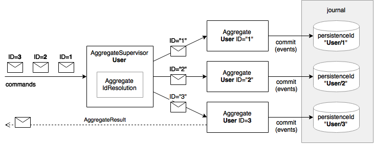
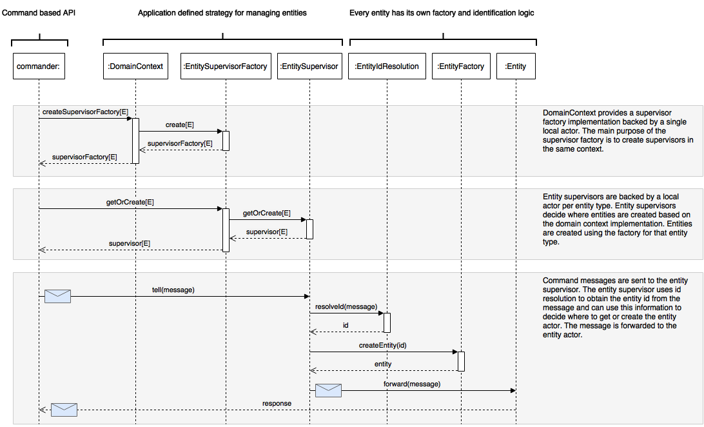

Akka CQRS
=========

### Warning: This is a work in progress, API changes are likely

Dependency
----------

To include this library into your `sbt` project, add the following lines to your `build.sbt` file:

    resolvers += "Product-Foundry at bintray" at "http://dl.bintray.com/productfoundry/maven"

    libraryDependencies += "com.productfoundry" %% "akka-cqrs" % "0.1.30"

This version of `akka-cqrs` is built using Akka 2.4.0 and Scala 2.11.7.

Usage
-----

## Command side

### Entities

Entities are persistent objects that implement DDD concepts. There are different entity types:

##### Aggregates

Aggregates process commands, validate business rules and generate events. They act as a context boundary for a single
domain concept. Typically, the aggregate represents a single instance, rather than a group. All aggregates reply with a
message indicating the update result.

##### Process managers

Process managers subscribe to events to execute long running processes. They have durable state to track a single
process using a finite state machine implementation. A process can subscribe to events from different aggregates.

#### Creation

## Query side

Inspiration
-----------
- [Reactive DDD with Akka](http://pkaczor.blogspot.nl/2014/04/reactive-ddd-with-akka.html)
- [Simple event sourcing ](http://blog.zilverline.com/2012/07/04/simple-event-sourcing-introduction-part-1/)
